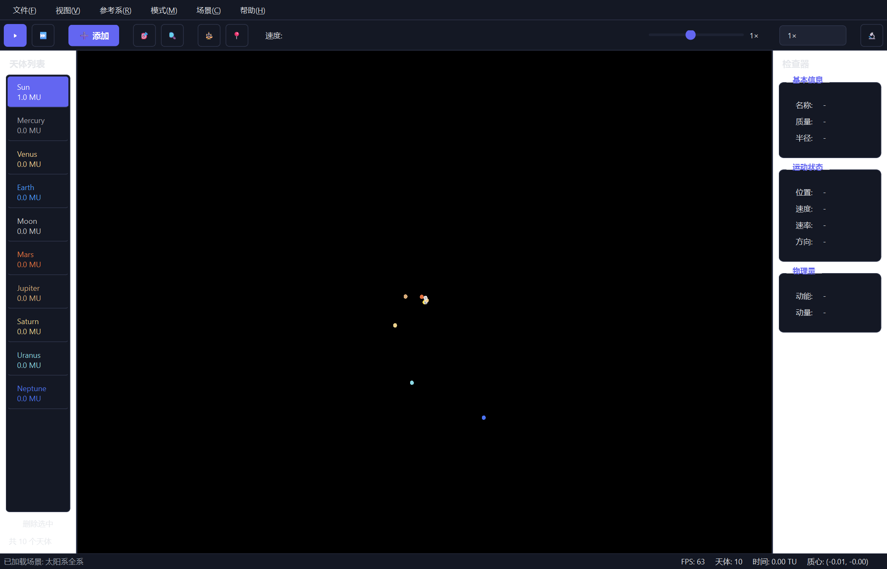

# 天体引力模拟器 · Celestial Evolution Simulation

> 基于 **PyQt6 + OpenGL** 的交互式 N 体引力模拟桌面应用，内置归一化模拟单位物理引擎（`G = 1`）、碰撞融合、轨迹显示、质心参考系、场景管理与运行时性能分析。

[English](README.md) | **简体中文**


[Windows x64 .exe](https://github.com/NoneWordsPig/Celestial-Evolution-Simulation/releases/download/v0.1/CelestialEvolutionSimulation-0.1-windows-x64.exe) · [Release 0.1](https://github.com/NoneWordsPig/Celestial-Evolution-Simulation/releases/tag/v0.1)


---

## 目录

- [简介](#简介)
- [特性](#特性)
- [截图](#截图)
- [安装](#安装)
- [快速开始](#快速开始)
- [使用说明](#使用说明)
  - [窗口布局](#窗口布局)
  - [菜单](#菜单)
  - [工具栏](#工具栏)
  - [鼠标与键盘](#鼠标与键盘)
  - [添加天体对话框](#添加天体对话框)
  - [状态栏](#状态栏)
  - [性能分析覆盖层](#性能分析覆盖层)
- [模式与单位](#模式与单位)
- [场景系统](#场景系统)
- [物理引擎](#物理引擎)
- [性能分析](#性能分析)
- [配置](#配置)
- [测试](#测试)
- [项目结构](#项目结构)
- [常见问题](#常见问题)
- [贡献指南](#贡献指南)
- [致谢](#致谢)
- [许可证](#许可证)

## 简介

这是一个二维 N 体引力模拟项目。它实时求解多体引力，允许你添加、删除、选中并检查天体，观察碰撞融合，并带有轨迹、动态比例尺和深色宇宙主题渲染。程序内置多个场景，包括经典的 Figure-8 三体轨道以及基于真实数据的太阳系模型。

物理核心与 UI 完全解耦：引擎只使用归一化模拟单位（质量 `MU`、距离 `DU`、时间 `TU`，引力常数 `G = 1`），现实世界单位（`kg`、`m`、`km`、`AU`、`M_sun`、`s`、`day`、`year`）由单位系统负责转换，仅在科学模式下的显示与输入中使用。

## 特性

- 基于 NumPy 向量化 O(N²) 求解器的实时 N 体引力模拟，带引力软化。
- 双积分器：**RK4**（默认）与 **Velocity Verlet**（辛积分），可通过场景文件选择。
- 碰撞检测与物理一致的融合（质量、动量、体积守恒）。
- 每个天体独立的轨迹历史，渐变渲染。
- 模拟 / 科学双模式：简洁模拟单位，或带科学计数法的现实单位并显示能量与动量。
- 质心参考系：平滑摄像机过渡与动量修正。
- 场景系统：JSON 场景的加载、保存、导入、导出；内置场景库（三体周期轨道 + 太阳系）。
- 摄像机：以光标为中心缩放、平移、适应全部、重置。
- 内置逐帧性能分析（物理 / UI / 渲染细分）与可选性能日志。
- 固定步长物理（30 Hz）与渲染（60 Hz）解耦运行。
- 深色现代 UI、提示气泡、科学计数法数值输入。

## 截图



## 安装

### Windows 0.1（无需安装 Python）

从 [GitHub Release 0.1](https://github.com/NoneWordsPig/Celestial-Evolution-Simulation/releases/tag/v0.1) 下载
[`CelestialEvolutionSimulation-0.1-windows-x64.exe`](https://github.com/NoneWordsPig/Celestial-Evolution-Simulation/releases/download/v0.1/CelestialEvolutionSimulation-0.1-windows-x64.exe)，双击运行。
程序包含 Python 运行环境、依赖和 9 个内置场景，需要 Windows x64 与支持 OpenGL 的显卡驱动。

保存的场景位于 `%LOCALAPPDATA%\Celestial Evolution Simulation\scenes`，退出或替换 exe 后仍会保留。
如需检查下载文件，可使用 Release 附带的 `SHA256SUMS.txt` 核对 SHA256。

### 从源码运行

环境要求：

- Python **3.11+**（在 **3.13** 上开发与测试）
- 支持 OpenGL 的显示环境（推荐 Windows 桌面）

安装依赖：

```bash
pip install -r requirements.txt
```

依赖内容：

```text
numpy>=1.26
PyQt6>=6.6
PyOpenGL>=3.1
```

### 构建 Windows exe

构建命令、依赖和实际 exe 的验证方法见 [BUILDING.md](BUILDING.md)。

```powershell
python -m pip install -r requirements-build.txt
python -m PyInstaller --noconfirm CelestialEvolutionSimulation.spec
```

输出位于 `dist/CelestialEvolutionSimulation-0.1-windows-x64.exe`。

## 快速开始

在仓库根目录运行：

```bash
python main.py
```

程序启动后自动加载 Figure-8 三体系统。可通过 **场景** 菜单加载其他场景。

## 使用说明

### 窗口布局

```
+--------------------------------------------------------------------------+
|  菜单栏                                                                   |
+--------------------------------------------------------------------------+
|  工具栏（播放 / 单步 / 添加 / 摄像机 / 参考系 / 速度 / 模式）                |
+--------+----------------------------------------------+------------------+
| 天体   |                                              | 检查器           |
| 列表   |            模拟视图（OpenGL）                  |（名称、质量、   |
|（左侧）|            天体 + 轨迹 + 比例尺                | 半径、运动状态、|
|        |            + 性能覆盖层                       | 动能、动量）    |
+--------+----------------------------------------------+------------------+
|  状态栏：FPS · 天体数量 · 模拟时间 · 质心                                    |
+--------------------------------------------------------------------------+
```

- **左侧面板 —— 天体列表**：所有天体的列表，可选中；通过按钮或 `Delete` 键删除选中天体。
- **中间 —— 模拟视图**：OpenGL 渲染区域。
- **右侧面板 —— 检查器**：选中天体的详细信息。
- **状态栏**：FPS、天体数量、模拟时间、质心。

### 菜单

| 菜单 | 动作 | 快捷键 | 说明 |
| --- | --- | --- | --- |
| 文件 | 添加天体 | `Ctrl+A` | 打开添加天体对话框。 |
| 文件 | 退出 | `Ctrl+Q` | 关闭程序。 |
| 视图 | 重置摄像机 | — | 将摄像机恢复到默认中心与缩放。 |
| 视图 | 适应所有天体 | — | 将所有天体放入视野（含 10% 边距）。 |
| 视图 | 显示/隐藏天体列表 | — | 显示或隐藏左侧面板。 |
| 视图 | 显示/隐藏检查器 | — | 显示或隐藏右侧面板。 |
| 视图 | 显示性能分析 | — | 切换模拟视图中的性能覆盖层（默认开启）。 |
| 参考系 | 跟随质心 | — | 平滑保持质心位于视野中央。 |
| 参考系 | 重置参考系 | — | 摄像机平滑移动到质心（0.8 s），并平滑将总动量修正为零（1.0 s）。 |
| 模式 | 模拟模式 | — | 使用 MU / DU / TU 简洁显示。 |
| 模式 | 科学模式 | — | 使用带科学计数法的现实单位。 |
| 场景 | 加载场景 | — | 选择 JSON 场景文件并应用。 |
| 场景 | 保存场景 | — | 将当前状态保存到 `scenes/<名称>.json`。 |
| 场景 | 导入场景 | — | 从任意路径导入 JSON 场景。 |
| 场景 | 导出场景 | — | 将当前状态导出到指定 JSON 文件。 |
| 场景 | *动态列表* | — | 启动时自动扫描 `scenes/` 下所有合法 JSON，点击即可加载。 |
| 帮助 | 关于 | — | 显示版本与功能摘要。 |

### 工具栏

| 按钮 | 动作 | 说明 |
| --- | --- | --- |
| ▶ / ⏸ | 播放 / 暂停 | 切换模拟推进。 |
| ⏭ | 单步执行 | 执行一步模拟。 |
| ➕ 添加 | 添加天体 | 打开添加天体对话框。 |
| 🎯 | 重置摄像机 | 同 视图 → 重置摄像机。 |
| 🔍 | 适应全部 | 同 视图 → 适应所有天体。 |
| ⚖️ | 重置参考系 | 同 参考系 → 重置参考系。 |
| 📍 | 跟随质心 | 开关，同 参考系 → 跟随质心。 |
| 速度滑杆 | 演进速度 | 对数刻度，**0.1× – 20×**（`1×` = 旧版 5×）。 |
| 倍速下拉框 | 速度预设 | 快速选择 0.1 / 0.5 / 1 / 2 / 5 / 10 / 20 ×。 |
| 🔬 / 🎮 | 切换模式 | 在模拟模式与科学模式之间切换。 |

速度滑杆使用对数刻度（位置 100 对应 1×）。调整速度不会改变数值步长：引擎始终以固定 `dt` 子步推进，只改变每秒执行的子步数。若倍率触及单帧子步上限（200），会弹出一次“倍率已达上限”提示 —— 该提示仅告知用户，不修改任何设置。

### 鼠标与键盘

| 输入 | 动作 |
| --- | --- |
| 左键点击天体 | 选中天体（同时选中列表项并刷新检查器）。 |
| 左键点击空白处 | 取消选择。 |
| 中键拖拽 | 平移摄像机。 |
| 鼠标滚轮 | 以光标为中心缩放（因子 1.1 / 0.9，钳制在 0.001–2000 px/DU）。 |
| `Delete`（天体列表聚焦时） | 删除选中天体（带确认）。 |
| `Ctrl+A` | 添加天体。 |
| `Ctrl+Q` | 退出。 |

### 添加天体对话框

通过 **文件 → 添加天体**、工具栏 **➕ 添加** 或 `Ctrl+A` 打开。

- **名称**：天体名称。
- **质量**：模拟模式为 `MU`；科学模式为 `kg` / `M_sun`，带单位下拉框。
- **半径**：模拟模式为 `DU`；科学模式为 `m` / `km` / `AU`（默认 `km`）。该半径为参与碰撞检测的物理半径。
- **位置 X / Y**：模拟模式为 `DU`；科学模式为 `m` / `km` / `AU`（默认 `AU`）。
- **速度** —— 两种输入模式，可随时切换：
  - **X/Y**：笛卡尔速度分量 `vx`、`vy`。
  - **V/θ**：极坐标速度 —— 速率与方向角（度）。
  - 单位：`DU/TU`，或科学模式的 `m/s`、`km/s`、`AU/T0`（默认 `km/s`）。在 X/Y 与 V/θ 之间切换时会自动换算当前数值。
- **颜色**：选择显示颜色（默认蓝色）。

所有数值输入框支持科学计数法，例如 `1e-6`、`3.003e-6`、`1.989e30`；编辑结束后按约 15 位有效数字规范显示。科学模式下，数值会先转换为归一化模拟单位再进入物理引擎。

### 状态栏

状态栏从左到右依次显示：

- **FPS**：实测帧率。
- **天体**：当前天体数量。
- **时间**：模拟时间 —— 模拟模式显示 `TU`；科学模式存在现实单位映射时显示天 / 年。
- **质心**：当前质心坐标 `(x, y)`。

### 性能分析覆盖层

模拟视图左上角的覆盖层实时显示逐帧耗时细分（通过 **视图 → 显示性能分析** 切换，默认开启，约每秒刷新 10 次）：

- 指标：**FPS**、平均 / p95 / 峰值帧周期，以及最近帧周期趋势图（平均值为虚线）。
- 9 个阶段的耗时表格（见 [性能分析](#性能分析)），显示毫秒数、占帧周期比例与比例条。
- 第二行指标：引擎耗时、天体数量、每帧子步数、碰撞融合次数。

## 模式与单位

物理引擎本身不感知模式 —— **模式只影响显示与输入**。切换模式不会改变任何模拟状态。

| 模式 | 显示 | 适用场景 |
| --- | --- | --- |
| 模拟模式 | 简洁模拟单位 `MU`、`DU`、`TU`、`DU/TU` | 探索轨道、调参、视觉演示。 |
| 科学模式 | 带科学计数法的现实单位（如 `1.989 × 10³⁰ kg`），并显示动能（J）与动量（kg·m/s） | 太阳系尺度工作、物理分析。 |

### 模拟单位

引擎使用 `G = 1` 的归一化单位：

| 物理量 | 单位 | 说明 |
| --- | --- | --- |
| 质量 | `MU` | `1 MU = 1` |
| 距离 | `DU` | `1 DU = 1` |
| 时间 | `TU` | 导出：`TU = sqrt(DU³ / (G·MU)) = 1` |
| 速度 | `DU/TU` | 导出：`VU = DU / TU = sqrt(G·MU/DU) = 1` |

### 科学归一化

`physics/unit_system.py` 定义了科学归一化：

- `L0 = 1 AU ≈ 1.495978707 × 10¹¹ m`
- `M0 = 1 M_sun ≈ 1.98892 × 10³⁰ kg`
- `T0 = sqrt(L0³ / (G_SI·M0))`，从而 `G_sim = 1`

常用恒等式（已由测试验证）：**1 年 ≈ 2π TU**，地球公转速度 ≈ **1 VU ≈ 29.78 km/s**。

### 现实单位映射

`UnitConverter.solar_system()` 提供太阳系尺度映射：

- `1 DU = 1 AU`
- `1 MU = 1 M_sun`
- 推导：`1 TU ≈ 0.112 年 ≈ 41 天`，`1 VU ≈ 29.8 km/s`

支持的现实单位：`kg`、`m`、`km`、`AU`、`M_sun`、`s`、`day`、`year`、`m/s`、`km/s`、`AU/T0`、`m/s²`、`km/s²`（别名对大小写与空格不敏感，如 `msun`、`yr`）。若无映射，科学模式回退到模拟单位并提示“当前未设置现实世界单位映射”。

## 场景系统

场景是普通 JSON 文件。`scenes/` 目录下所有合法 JSON 文件都会在启动时被自动扫描并显示在 **场景** 菜单中。

### 内置场景

| 文件 | 场景 | 说明 |
| --- | --- | --- |
| `solar_system.json` | 太阳系全系 | 太阳、八大行星与月球，使用真实质量 / 半径 / 轨道要素，归一化后 `1 DU = 1 AU`、`1 MU = 1 M_sun`。 |
| `figure8.json` | Figure-8 三体系统 | 经典 Figure-8 稳定周期轨道（Chenciner & Montgomery, 2000），等质量，周期 ≈ 6.326。 |
| `lagrange.json` | 拉格朗日等边三角解 | 拉格朗日等边三角形特解（1772），等质量匀速旋转。 |
| `butterfly.json` | 蝴蝶轨道 Butterfly I | 三体周期轨道（Šuvakov & Dmitrašinović, 2013）。 |
| `bumblebee.json` | 大黄蜂轨道 Bumblebee | 三体周期轨道（Šuvakov & Dmitrašinović, 2013）。 |
| `dragonfly.json` | 蜻蜓轨道 Dragonfly | 三体周期轨道（Šuvakov & Dmitrašinović, 2013）。 |
| `goggles.json` | 护目镜轨道 Goggles | 三体周期轨道（Šuvakov & Dmitrašinović, 2013）。 |
| `moth.json` | 飞蛾轨道 Moth I | 三体周期轨道（Šuvakov & Dmitrašinović, 2013）。 |
| `yinyang.json` | 阴阳轨道 Yin-Yang I | 三体周期轨道（Šuvakov & Dmitrašinović, 2013）。 |

### 场景 JSON 格式

```json
{
  "format_version": 1,
  "name": "Figure-8 三体系统",
  "description": "Classic Figure-8 stable periodic orbit",
  "units": { "length": "DU", "mass": "MU", "time": "TU", "velocity": "DU/TU" },
  "G": 1.0,
  "integrator": "rk4",
  "timestep": 0.0005,
  "time_scale": 1.0,
  "simulation_time": 0.0,
  "camera": { "center_x": 0.0, "center_y": 0.0, "zoom": 150.0,
              "viewport_width": 1400, "viewport_height": 900 },
  "bodies": [
    { "name": "Body 1", "mass": 1.0, "radius": 0.0001,
      "render_radius": 0.0001,
      "position": [-0.97000436, 0.24308753],
      "velocity": [0.4662036850, 0.4323657300],
      "color": [1.0, 0.3, 0.3] }
  ]
}
```

| 字段 | 类型 | 说明 |
| --- | --- | --- |
| `format_version` | int | 场景格式版本（`1`）。 |
| `name` / `description` | string | 显示名称与描述。 |
| `units` | object | 声明的单位元数据（仅记录用途）。 |
| `G` | number | 引力常数（归一化单位下恒为 `1.0`）。 |
| `integrator` | string | `rk4` 或 `verlet`；加载场景时会重建积分器。 |
| `timestep` | number | 固定物理步长（`TU`）。 |
| `time_scale` | number | 速度倍率，加载后同步到 UI。 |
| `simulation_time` | number | 已模拟时间（`TU`）。 |
| `camera` | object | 摄像机中心、缩放与视口尺寸。 |
| `bodies[]` | array | 天体定义：`name`、`mass`、`radius`（物理半径）、`render_radius`（可选，默认等于 `radius`）、`position`、`velocity`、`color`（RGB 0–1）。 |

## 物理引擎

### 架构约束

- `PhysicsEngine` 不得依赖 UI。
- `UnitSystem` 不得依赖 `PhysicsEngine`。
- `SceneManager` 只负责场景序列化，不进行物理计算。
- Renderer 不得修改模拟状态。
- `Camera` 只负责显示坐标转换。
- UI 不直接执行物理计算。

### 数值规则

- 引擎内部统一使用 **float64/double**。
- 引擎只使用 **归一化模拟单位**，`G = 1`；引擎不直接处理 SI 引力常数。
- 所有现实世界单位（`kg`、`m`、`km`、`AU`、`M_sun`、`s`、`day`、`year`）由单位系统转换。
- 默认积分器为 **RK4**，另有 **Velocity Verlet**（辛积分）可选。不要移除 RK4 —— 后续如需更高阶辛几何积分，应作为独立 `Integrator` 类新增。

### 模拟循环

每个物理子步依次执行：

1. **积分** —— 计算引力加速度（O(N²)，NumPy 向量化，软化因子 `ε = 1e-8 DU`），然后由 RK4 或 Velocity Verlet 更新位置与速度。
2. **碰撞** —— 距离小于 `(physical_radius₁ + physical_radius₂) × 1.0` 的天体对融合为一个天体，保持质量、动量与体积守恒（`r_new = (r₁³ + r₂³)^(1/3)`）；渲染半径独立按体积守恒合并；颜色按质量加权。
3. **轨迹** —— 将位置追加到每个天体的轨迹与全局历史（有界 `deque`，最多 1000 点；渲染时均匀采样最多 1000 点）。
4. **推进时间** 固定 `dt`。

时间模型：

- 物理以 **30 Hz** 固定步长推进（默认 `dt = 0.001 TU`），配合累加器实现平滑运动。
- 渲染以 **60 Hz** 运行，与物理解耦。
- 目标推进速率 = `BASE_SIMULATION_RATE × time_scale`（`BASE_SIMULATION_RATE = 5 × 60 × dt`，即默认 `dt` 下为 `0.3 TU/s`；`1×` 等于旧版 5× 速度）。
- 单帧最多执行 `MAX_SUBSTEPS_PER_FRAME = 200` 个子步，超出部分直接丢弃（宁可平滑也不追帧卡顿）。

### 只读查询接口

引擎为 UI / 格式化器提供只读状态查询（`get_body_state`、`get_all_body_states`、`body_acceleration`、`body_net_force`、`body_distances`、`body_kinetic_energy`、`snapshot` 等），以及聚合量（`center_of_mass`、`total_momentum`、`kinetic_energy`、`potential_energy`、`total_energy`、`total_mass`）。

## 性能分析

### 0.1 的性能优化

天体与轨迹使用共用 VBO 批量渲染，轨迹在物理更新之间复用缓冲。
RK4 和 CPU 引力计算共用单一实现，RK4 中间状态使用 NumPy 批量计算；
四阶段 RK4、float64、固定步长与 G=1 保持不变。FPS 统计来自实际绘制。

本机太阳系九体基准中，5× 从约 45.5 FPS 提升到 62.6，10× 从约 29.8 提升到 62.0。
连续 1000 步与原版本数值结果一致。测量条件与限制见 [优化验证报告](PERFORMANCE_OPTIMIZATION.md)。


`ui/profiler.py` 通过运行时方法包装对运行中的应用进行插桩，不修改任何物理算法。统计使用 60 帧滚动窗口。

| # | 阶段 | 统计内容 |
| --- | --- | --- |
| 1 | 引力计算 | `GravitySolver.compute_accelerations`（RK4 k1–k4）。 |
| 2 | 积分器（RK4）更新 | 积分器除引力调用外的簿记开销。 |
| 3 | 碰撞检测 | 检测与融合。 |
| 4 | 轨迹 / 历史更新 | 轨迹记录。 |
| 5 | 天体状态更新 | 引擎余量（advance 减去积分器 / 碰撞 / 轨迹）。 |
| 6 | 动量计算 | 质心 / 总动量查询。 |
| 7 | 能量计算 | 动能 / 势能查询。 |
| 8 | UI 同步 | 状态栏、检查器与参考系定时回调。 |
| 9 | 未计入时间 | 帧周期减去第 1–8 阶段与渲染，细分为：`a` Qt 事件分发、`b` 睡眠 / 帧率限制、`c` 操作系统调度、`d` GPU 同步（`glFinish`）、`e` 未知 / 未跟踪。 |
| — | 渲染 | `paintGL` 总耗时（轨迹、天体、覆盖层、GPU 同步）。 |

## 配置

| 环境变量 | 默认值 | 说明 |
| --- | --- | --- |
| `PERF_LOG` | `0` | 设为 `1` 开启逐帧性能日志，文件每秒刷新一次。 |
| `PERF_LOG_PATH` | `<项目根>/logs/performance.log` | 逐帧日志的输出路径。 |

性能日志每帧输出一行；每秒聚合统计均值 / 峰值 / 1 秒窗口均值。

## 测试

在仓库根目录运行全部测试：

```bash
python -m unittest discover -v
```

运行单个模块：

```bash
python -m unittest test_physics_units -v
```

测试覆盖单位 / 换算、RK4 数值验证、碰撞、渲染、缓存、FPS 统计、摄像机 / 比例尺、格式化器、参考系、场景往返与打包数据路径。

## 项目结构

```text
.
├── app_metadata.py              # Version / application identity
├── app_paths.py                 # Bundled resources / persistent user data
├── CelestialEvolutionSimulation.spec # Windows exe build
├── main.py                      # 程序入口
├── requirements.txt             # Python 依赖
├── physics/                     # 物理引擎包（不依赖 UI）
│   ├── engine.py                #   PhysicsEngine 主循环
│   ├── gravity.py               #   O(N²) 引力求解器（带软化）
│   ├── integrator.py            #   RK4 + Velocity Verlet + 工厂
│   ├── collision.py             #   碰撞检测与融合
│   ├── body.py                  #   天体数据类
│   ├── constants.py             #   G=1、软化、步长、限制等常量
│   ├── units.py                 #   UnitSystem / UnitConverter
│   ├── unit_system.py           #   科学归一化（AU、M_sun、T0）
│   ├── formatter.py             #   模拟 / 科学格式化器
│   ├── mode.py                  #   Mode 枚举（仅显示层）
│   ├── scene_manager.py         #   JSON 场景保存 / 加载 / 导入 / 导出
│   ├── camera.py                #   世界坐标 <-> 屏幕坐标
│   ├── scale_bar.py             #   动态比例尺（1-2-5 序列）
│   ├── reference_frame.py       #   质心参考系
│   └── transitions.py           #   摄像机 / 动量平滑过渡
├── ui/                          # PyQt6 桌面界面
│   ├── main_window.py           #   主窗口、菜单、工具栏、状态栏
│   ├── body_renderer.py         #   Batched body geometry
│   ├── trail_renderer.py        #   Trail building / caching
│   ├── gl_buffers.py            #   Shared OpenGL buffer lifecycle
│   ├── render_coordinates.py    #   Shared Camera-based transform
│   ├── simulation_widget.py     #   OpenGL 模拟视图 + 交互
│   ├── body_list_widget.py      #   左侧天体列表
│   ├── inspector_widget.py      #   右侧检查器
│   ├── add_body_dialog.py       #   添加天体对话框（笛卡尔 / 极坐标速度）
│   ├── scientific_number_input.py # 科学计数法数值输入控件
│   ├── profiler.py              #   FrameProfiler + 性能日志
│   ├── styles.py                #   深色主题
│   ├── toast.py                 #   提示气泡
│   └── control_panel.py         #   旧版控制面板（主窗口未使用）
├── scenes/                      # JSON 场景（启动时自动扫描）
├── logs/performance.log         # 逐帧性能日志
└── test_*.py                    # unittest 测试套件
```

> 说明：工作目录中的 `天体模拟器.html` 是旧版单文件浏览器原型，已被 git 忽略，不属于被跟踪的项目内容。

## 常见问题

**问：为什么会出现“倍率已达上限”？**

为防止卡顿，引擎将每帧子步数限制为 200。触及上限后，继续提高倍率不会再加速。此时应减少天体数量或降低倍率。

**问：为什么科学模式显示“当前未设置现实世界单位映射”？**

未配置现实单位映射，显示回退到模拟单位。配置 `UnitConverter.solar_system()` 之类的映射后即可显示 `AU`、`M_sun`、`km/s` 与天 / 年。

**问：模拟视图黑屏或报 OpenGL 错误。**

请确认已安装 PyOpenGL 且显卡驱动支持 OpenGL。无硬件 OpenGL 的环境可尝试软件渲染驱动。

**问：当前使用哪个积分器？**

主窗口默认使用 RK4。场景文件声明自己的积分器（`rk4` 或 `verlet`），加载场景时会按声明重建引擎积分器。

**问：如何添加真实的太阳系天体？**

切换到科学模式，质量使用 `M_sun` / `kg`，位置使用 `AU` / `km` / `m`，速度使用 `km/s` 输入即可。

## 致谢

- Figure-8 轨道：A. Chenciner 与 R. Montgomery，《A remarkable periodic solution of the three-body problem in the case of equal masses》，Annals of Mathematics, 2000。
- 蝴蝶 / 大黄蜂 / 蜻蜓 / 护目镜 / 飞蛾 / 阴阳等周期轨道：M. Šuvakov 与 V. Dmitrašinović，《Three-dimensional family of periodic orbits in the equal-mass Newtonian three-body problem》，arXiv:1303.0181, 2013。
- 等边三角形解：J.-L. Lagrange，1772。

## 许可证

目前项目未包含许可证文件。在声明许可证之前，版权归作者所有。
